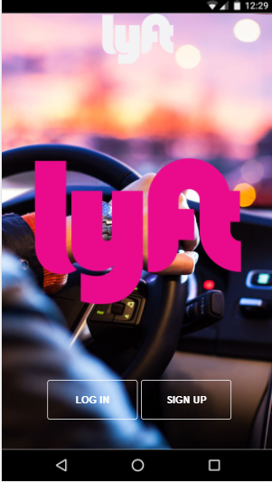
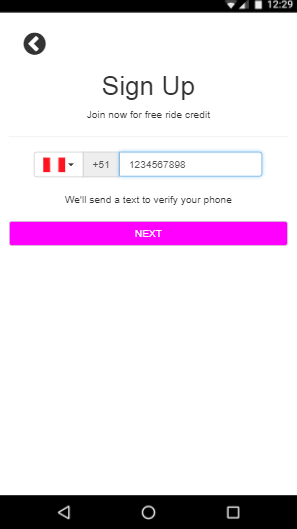
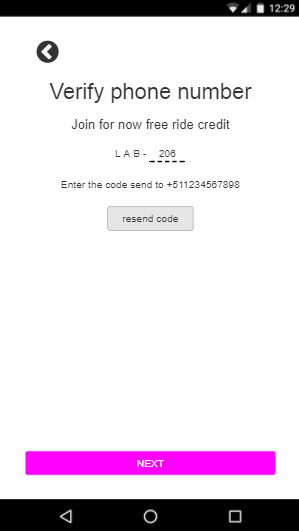
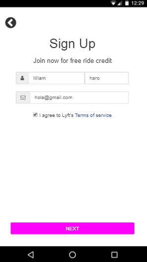
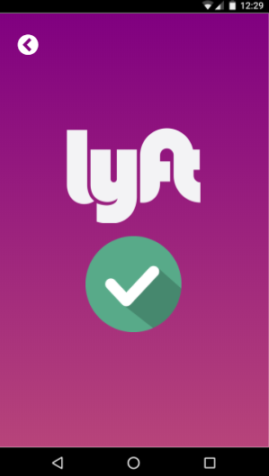

## README
1. **Descripcion del proyecto:**
  - Este proyecto contiene un simulacion del app de lyft, siguiendo la ruta del sign-up (verificacion de número celular y registro de datos)

2. **Autor:**

  - Lilliam Haro (v-apple)

2. **Herramientas utilizadas:**

  - HTML5
  - CSS3
  - Jquery
  - Bootstrap

  **VISTA DE LA APLICACION EN ORDEN**

